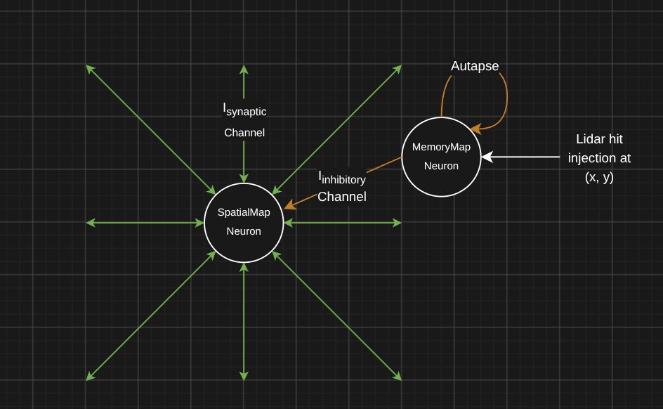

# Overview

# Neuron Populations
Three neuron populations exist within the model: SpatialMap, MemoryMap, and SpikeSourceArray. Each neuron population interacts with other neuron populations, via synaptic connections, yet each perform a distinct function. It should be noted that both the SpatialMap and MemoryMap neurons share the same values upon initialisation besides a few values which have either been fine tuned or are values of varibles exclusive to the respective population.

## SpatialMap Neuron Population
The SpatialMap neuron population is assigned with the task of representing the environment, about the robot, in a temporally dynamic manner. The level of inhibitory current, $I_{\text{inh}}$, within a SpatialMap neuron encodes the presence or absence of an object. For example, higher levels of inhibitory current indicate the presence of an object in the (x, y) coordinate. A constant decay is applied to the inhibitory current of a neuron: decreasing the accumulated value per step of the model. This results in injections to the model, in the absence of persistence, decaying over time: achieving
temporally dynamic behaviour.

$$V(t+1) = \frac{-(V(t) - V_{\text{rest}}) + I_{\text{syn}} - I_{\text{inh}}}{\tau_M}\ \Delta t$$

## MemoryMap Neuron Population
$$V(t+1) \mathrel{+}= \frac{-(V(t) - V_{\text{rest}}) + I_{\text{syn}} + \text{latchGate}\cdot I_{\text{latch}}}{\tau_M}\\Delta t$$

## SpikeSourceArray Neuron Population
