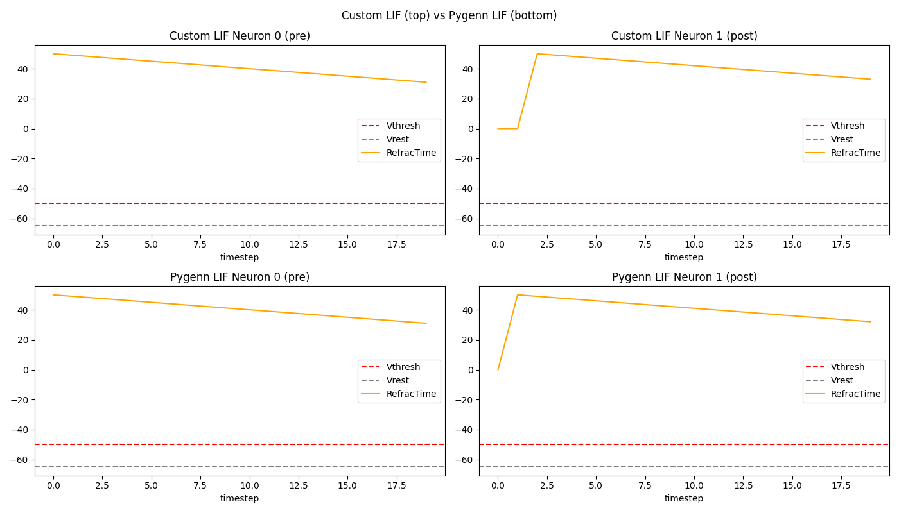
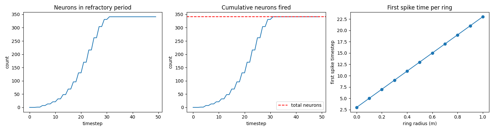
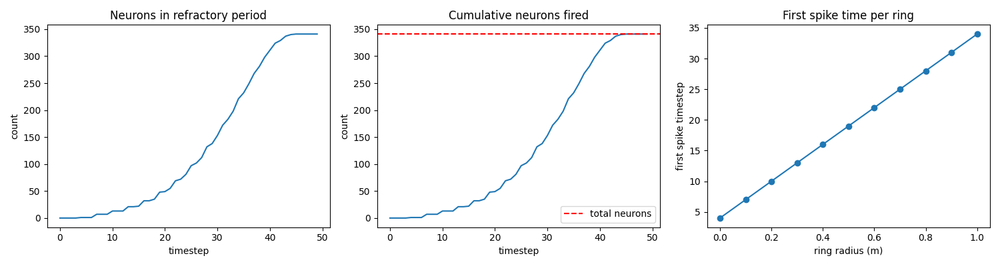

# WPSNN Architecture
## Neuron Lattice
WPSNN is organised into a neuron lattice that exists in a spherical coordinate system space, of radius R, segmented by rings. The origin neuron is (0, 0).
Each ring is defined using...

$$r = i \cdot d$$

...where $d$ is neuronSpacing and i is a natural number with bounded between [0, ceil(R/d)]

Arc-length scaling is used to determine the number of neurons to apply, per ring, to ensure uniform density across all rings. The number of neurons on ring r, N(r), is defined as...

$$N(r) = ceil\bigg(\frac{2\pi r}{d}\bigg)$$

The angular difference on each ring, $\Delta \theta$, is the angle between adjacent neurons on the same ring. The angular difference of ring r is defined as...

$$ \Delta \theta (r) = \frac{2\pi}{N(r)} $$

# Measurement Binning
A LIDAR sensor will output a measurement vector, $\vec{z}$, which has 3 elements with a real number value.

$$ \vec{z} = \begin{bmatrix}r \\ \theta \\ \phi \end{bmatrix}$$

The neuron lattice is a discrete structure. Therefore, continous measurements are made to correspond with neurons at discrete locations. This is done by binning the 3 
measurements part of the measurement vector. This forms a binned equivalent of the measurements vector where each element is a number from a discrete domain defined by the 
neuron lattice. The binned equivalents are calculated via...

$$r_{binned} = round\bigg(\frac{r}{d}\bigg) \cdot d$$

$$\theta_{binned} = \bigg(\ round\bigg(\frac{\theta}{\Delta \theta_{bin}}\bigg) \cdot \Delta \theta_{bin} \bigg) mod 2\pi$$

... where $d$ is the neuron spacing and $\Delta \theta_{bin}$ is the thetaBinWidth. The thetaBinWidth controls the domain a bin covers. The modulo operation wraps values, at exist outside the boundary of a possible domain, back to the other side.

# Propagation Diagnostics
## Import Details
Custom LIF model uses Euler integration whilst PyGenn LIF model uses exact exponential integration.

## Custom LIF vs PyGenn LIF Refactory Times

## Wavefront Propagation

### PyGenn LIF

### Custom LIF

